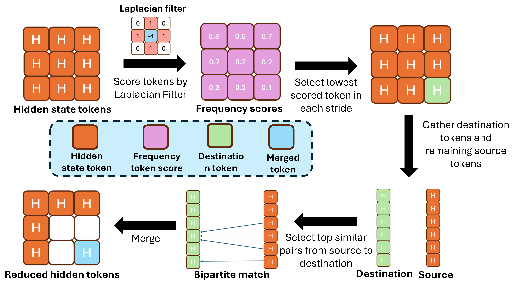

# BiGain: Unified Token Compression for Joint Generation and Classification

Official implementation for BiGain.

<p align="center">
  
</p>

**Framework of our BiGain<sub>TM</sub> method.** A Laplacian filter is applied to hidden-state tokens to compute local frequency scores. In each spatial stride, the lowest-scoring token is selected as a destination token, while the others form the source set. Destination and source tokens are gathered globally, and a bipartite matching selects top source-destination pairs.

## Environment Setup

1. Create conda environment:
```bash
conda create -n diffusion-exp python=3.9
conda activate diffusion-exp
```

2. Install dependencies:
```bash
pip install -r requirements.txt
```

3. Install ToMe package:
```bash
cd tomesd && python setup.py build develop && cd ..
```

4. Set dataset path:
```bash
export DATASET_ROOT=/path/to/your/datasets
```

## Running Experiments

All experiments are configured through shell scripts in the `scripts/` directory.

### Classification Experiments

```bash
# Stable Diffusion zero-shot classification
bash scripts/sd_classification.sh

# DiT (Diffusion Transformer) classification
bash scripts/dit.sh
```

### Generation Experiments

```bash
# Stable Diffusion image generation
bash scripts/sd_generation.sh

# DiT image generation
bash scripts/dit_generation.sh
```

### Configuration

To run an experiment:
1. Open the desired script
2. Uncomment one of the example configurations
3. Adjust parameters if needed
4. Run the script

### Available Methods

- **Baseline**: No acceleration
- **ToMe**: Original Token Merging 
- **BiGain_TM (LGTM)**: Our scoring-based token merging method
- **ToDo**: Token downsampling
- **BiGain_TD (IEKVD)**: Our linear blend token downsampling method
- **SiTo**: Similarity-based token pruning

## Code Attribution

This implementation builds upon code from:
- **Zero-shot classification framework**: Li et al., "Your Diffusion Model is Secretly a Zero-Shot Classifier", ICCV 2023 [[Paper]](https://openaccess.thecvf.com/content/ICCV2023/html/Li_Your_Diffusion_Model_is_Secretly_a_Zero-Shot_Classifier_ICCV_2023_paper.html) [[Code]](https://github.com/diffusion-classifier/diffusion-classifier)
- **ToMe**: Bolya & Hoffman, "Token Merging for Fast Stable Diffusion", CVPR Workshops 2023 (MIT License) [[Paper]](https://openaccess.thecvf.com/content/CVPR2023W/ECV/html/Bolya_Token_Merging_for_Fast_Stable_Diffusion_CVPRW_2023_paper.html) [[Code]](https://github.com/dbolya/tomesd)
- **ToDo**: Smith et al., "ToDo: Token Downsampling for Efficient Generation of High-Resolution Images", IJCAI 2024 [[Paper]](https://arxiv.org/abs/2402.13573) [[Code]](https://github.com/ethansmith2000/ImprovedTokenMerge)
- **SiTo**: Zhang et al., "Training-Free and Hardware-Friendly Acceleration for Diffusion Models via Similarity-based Token Pruning", AAAI 2025 [[Paper]](https://ojs.aaai.org/index.php/AAAI/article/view/33071) [[Code]](https://github.com/EvelynZhang-epiclab/SiTo)
